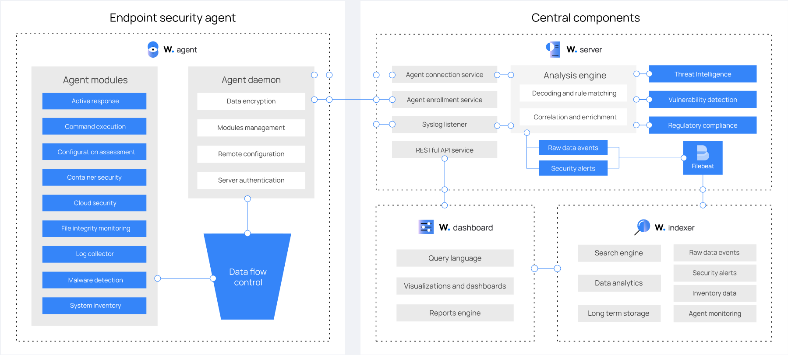

# Look-Into-Wazuh

https://documentation.wazuh.com/current/deployment-options/docker/wazuh-container.html

## Why?

1. Wazuh platform provides XDR and SIEM features to protect our cloud, container, and server workloads.
   - XDR (Extended Detection and Response) helps in detecting, investigating, and responding to threats across various environments.
   - SIEM (Security Information and Event Management) centralizes security data from multiple sources, enabling real-time analysis and response to security incidents.
2. We'll have:
   a. **Log analysis**: Analyzing logs from various sources to identify security threats and anomalies.
   b. **Intrusion and malware detection**: Detecting unauthorized access and malicious software within the environment.
   c. **File integrity monitoring**: Monitoring changes to files and directories to detect unauthorized modifications.
   d. **Configuration assessment**: Evaluating system configurations against security best practices to identify vulnerabilities.
   e. **Vulnerability detection**: Identifying known vulnerabilities in software and systems to mitigate risks.
   f. **Support for regulatory compliance**: Assisting in meeting compliance requirements by providing security monitoring and reporting capabilities.
3. Aside from agent-based monitoring capabilities, Wazuh can monitor agent-less devices such as firewalls, switches, routers, or network IDS, etc.

## Components:

### Wazuh Indexer:

- Highly scalable, full-text search and analytics engine.
- Central component that indexes and stores alerts generated by Wazuh server.

### Wazuh Server:

- Analyzes data received from agents.
- It processes it through decoders and rules, using threat intelligence to look for well-known indicators of compromise (IoCs).
- This central component is responsible for managing agents, configuring and upgrading them remotely when necessary

#### Debugging

- See agents registred to the manager: `sudo /var/ossec/bin/agent_control -l`

### Wazuh Dashboard:

- Web user interface for data visualization and analysis.
- Out of the box dashboards for:

  - Threat hunting
  - Regulatory compliance (e.g.
    - PCI DSS(Payment Card Industry Data Security Standard):
      - A set of security standards designed to ensure that all companies that accept, process, store or transmit credit card information maintain a secure environment.
    - GDPR(General Data Protection Regulation):
      - A regulation in EU law on data protection and privacy in the European Union and the European Economic Area.
      - This regulation requires organizations to protect personal data and ensure the privacy of individuals.
    - CIS (Center for Internet Security)
      - A nonprofit organization that develops best practices and benchmarks for securing IT systems and data.
    - HIPAA (Health Insurance Portability and Accountability Act)
      - A US law that provides data privacy and security provisions for safeguarding medical information.
    - NIST 800-53 (US National Institute of Standards and Technology)
      - A set of security and privacy controls for federal information systems and organizations.
  - Detected vulnerable applications
  - File integrity monitoring data
  - Configuration assessment results
  - Cloud infrastructure monitoring events

- `systemctl status wazuh-dashboard`
- Default credentials:
  - Username: admin
  - Password: changeme
    > Change the credentials using the password changing tool

### Wazuh Agent:

- Installed on endpoints such as laptops, desktops, servers, and containers.
- They provide threat prevention, detection, and response capabilities.

> We can't install both Wazuh Agent and Wazuh Manager on the same machine.

#### Problems When Deploying:

- If getting `mv: cannot overwrite '/var/ossec/etc/shared/default': Directory not empty`
  - backup the older file and let the post install script finish `sudo dpkg --configure -a`
  - or just remove the file `sudo rm -rf /var/ossec/etc/shared/default` (not recommended for production)



## Proof of Concepts

### Block a known malicious actor

- We'll block a malicious IP addresses from accessing web resources on a web server.

- We'll install apache web server and monitor its logs with Wazuh agent
- `sudo apt-get update && sudo apt-get install apache2`
  - if firewall is enabled, allow external access to apache web server
    - `sudo ufw status` show the status of the firewall
    - `sudo ufw app list` list the available applications
    - `sudo ufw allow in "Apache"` allow external access to apache web server
- `sudo systemctl status apache2` check the status of the apache web server
- Add configuration to `/var/ossec/etc/ossec.conf` file to configure the Wazuh agent and monitor the apache access logs
  ```xml
  <localfile>
    <log_format>syslog</log_format>
    <location>/var/log/apache2/access.log</location>
  </localfile>
  ```
- Restart the Wazuh agent `sudo systemctl restart wazuh-agent`

- Add a custom rule to trigger a Wazuh active response script (`/var/ossec/etc/rules/local_rules.xml`)

  ```xml
  <group name="attack">
    <rule id="100100" level="10">
      <if_group>web|attack|attacks</if_group>
      <list field="src_ip" lookup="address_match_key">/etc/lists/blacklist-alienvault</list>
      <description>IP address found in AlienVault reputation database.</description>
    </rule>
  </group>
  ```

- Edit the Wazuh server `/var/ossec/etc/ossec.conf` configuration file and add the `/etc/lists/blacklist-alienvault` list to the `<ruleset>` section.

  ```xml
  <ossec_config>
    <ruleset>
      <!-- Default ruleset -->
      <decoder_dir>ruleset/decoders</decoder_dir>
      <rule_dir>ruleset/rules</rule_dir>
      <rule_exclude>0215-policy_rules.xml</rule_exclude>
      <list>etc/lists/audit-keys</list>
      <list>etc/lists/amazon/aws-eventnames</list>
      <list>etc/lists/security-eventchannel</list>
      <list>etc/lists/blacklist-alienvault</list>

      <!-- User-defined ruleset -->
      <decoder_dir>etc/decoders</decoder_dir>
      <rule_dir>etc/rules</rule_dir>
    </ruleset>
  </ossec_config>
  ```

- Add the Active Response block to the Wazuh server `/var/ossec/etc/ossec.conf` configuration file.

  - `firewall-drop` command integrates with the Ubuntu local ip tables firewall and drops incoming network connection from the attacker endpoint for 60 seconds.

  ```xml
  <ossec_config>
    <active-response>
      <disabled>no</disabled>
      <command>firewall-drop</command>
      <location>local</location>
      <rules_id>100100</rules_id>
      <timeout>60</timeout>
    </active-response>
  </ossec_config>
  ```

- restart the Wazuh server to apply the changes: `sudo systemctl restart wazuh-manager`

#### Emulation of an attack

- `curl http://<WEBSERVER_IP>/`
- first the attacker endpoint conencts to the victims's web servers the first time
- After the first connection, the Wazuh Active Response module temporarily blocks any successive connection to the web servers for 60 seconds.
- In dashboard u can view the rul.id (100100)

### File Integrity Monitoring

- FIM helps in auditing sensitive files and meeting regulatory compliance requirements.
- Wazuh has an inbuilt FIM module that monitors file system changes to detect the creation, modification, and deletion of files.

- Wazuh FIM module enriches alert data by fetching information about the user and process that made the change using `who-data audit`

  - `who-data audit` is a command that fetches information about the user and process that made the change.

- Edit the Wazuh agent `/var/ossec/etc/ossec.conf`
- Add the directories for monitoring within the `<syscheck>` block.

  - To get additional information about the user and process that made the changes, enable `who-data audit`

  - `<directories check_all="yes" report_changes="yes" realtime="yes">/root</directories>`

- Restart the Wazuh agent `sudo systemctl restart wazuh-agent`

### Detecting Brute force attacks

- Brute-forcing is a common attack vector that threat actors use to gain unauthorized access to endpoints and services.
- SSH and RDP on Windows endpoints are prone to brute-force attacks.
- Wazuh identifies brute-force attacks by correlating multiple authentication failure events.

#### Emulation

- Install hydra tool to perform brute-force attacks
  - `sudo apt-get update && sudo apt-get install hydra`
- Create a text file with random passwords.

  - `sudo hydra -l badguy -P <password-list> <IP> ssh`:
    - `-l` specifies the username to use for the attack.
    - `-P` specifies the path to the password list file.
  - `sudo hydra -l badguy -P <password-list> rdp://<WINDOWS_IP>`:
    - `rdp` specifies the Remote Desktop Protocol service.

- Visualize the laerts in the Wazuh dashboard.
  - Go to Threat Hunting > Filter alters in search bar: `rule.id:(5551 OR 5712)`
  - Other related rules: `5710, 5711, 5716, 5720, 5503, 5504`
  - For windows: `60122 OR 60204`

### Monitoring Docker Events

- Docker automates the deployment of different applications inside software containers.
- Wazuh module for Docker identifies security and incidents across contrainers and alerts in real-time.

- Install Python and pip `sudo apt install python3 python3-pip`
- Upgrade pip `pip3 install --upgrade pip`
- Install docker and Python Docker library:

  - Python 3.8-3.10: `sudo pip3 install docker==7.1.0 urllib3==1.26.20 requests==2.32.2`
  - Python 3.11-3.12: `sudo pip3 install docker==7.1.0 urllib3==1.26.20 requests==2.32.2 --break-system-packages`

- Make sure that there is a Docker daemon running on the host machine.
- In `/var/ossec/etc/ossec.conf` file, add the block to enable `docker-listener` module.

```xml
<ossec_config>
  <wodle name="docker-listener">
    <interval>10m</interval>
    <attempts>5</attempts>
    <run_on_start>yes</run_on_start>
    <disabled>no</disabled>
  </wodle>
</ossec_config>
```

- Then restart the wazuh agent `sudo systemctl restart wazuh-agent`

#### Emulation

```bash
docker pull nginx
docker run -d -P --name nginx_container nginx
docker exec -it nginx_container cat /etc/passwd
docker exec -it nginx_container /bin/bash
exit


docker stop nginx_container
docker rm nginx_container
```

### Monitoring AWS infrastructure

- Wazuh module for AWS (aws-s3) enables the log data collection from different AWS sources.
- Wazuh default ruleset parses AWS logs and generates alerts automatically
  - These alerts appear as soon as Wazuh recives the logs from the AWS S3 bucket.

#### Emulation

- Access Cloud Trail, create new trail.
- Enable s3 bucket logging (create a new bucket or use an existing one).
- In wazuh server:

```xml
<wodle name="aws-s3">
  <disabled>no</disabled>
  <interval>30m</interval>
  <run_on_start>yes</run_on_start>
  <skip_on_error>no</skip_on_error>

  <bucket type="cloudtrail">
    <name><AWS_BUCKET_NAME></name>
    <aws_profile><AWS_PROFILE_NAME></aws_profile>
  </bucket>
</wodle>
```

- Restart the wazuh manager to apply changes: `sudo systemctl restart wazuh-manager`

### Detecting an SQL injection attack

- Monitor a local file, similar to what we did for apache
- Restart wazuh-agent
- `curl -XGET  "http://<UBUNTU_IP>/users/?id=SELECT+*+FROM+users";`
- Visualize with rule id: `31103` or `31106`

### Monitoring execution of malicious commands

- Auditd is an auditing utility native to Linux systems.
- It's used for accounting actions and changes in a Linux endpoint.

## Troubleshooting

### `python` No such file or directory

- Location: `/var/ossec/logs/ossec.log`
- Fix: `sudo ln -s /usr/bin/python3 /usr/bin/python`
